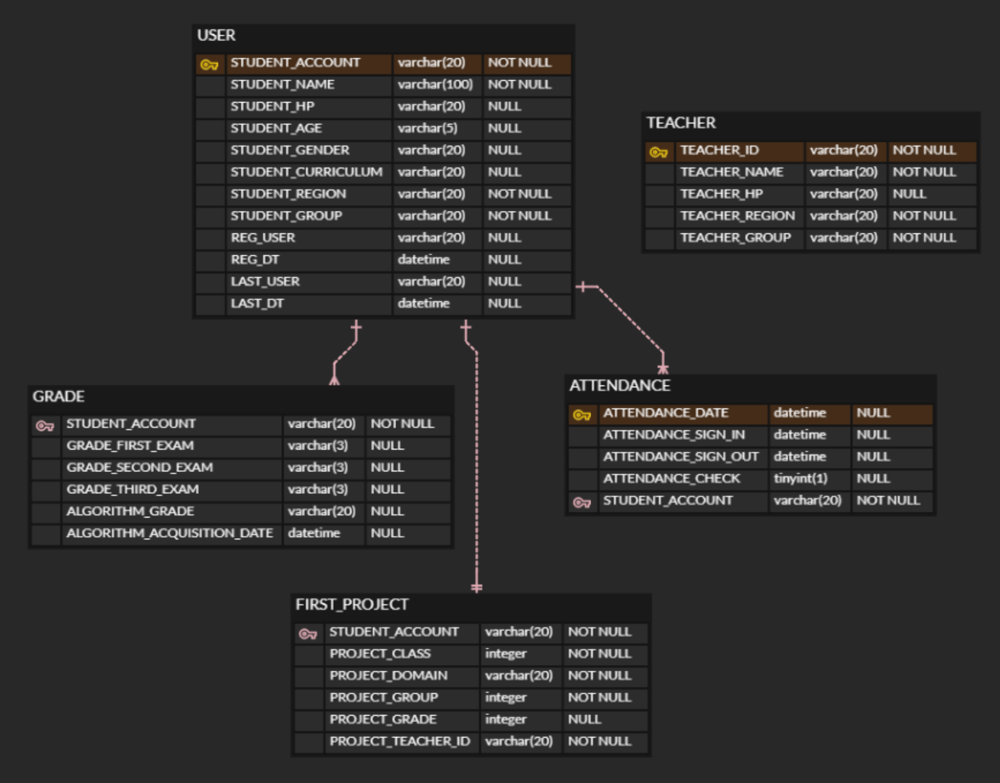

200309 _ 관계형 데이터베이스

1) 테이블 ERD_DIAGRAM




2) 기본 DB 스키마 SQL

```sql
CREATE TABLE `USER` (
	`STUDENT_ACCOUNT`	varchar(20)	NOT NULL,
	`STUDENT_NAME`	varchar(100)	NOT NULL,
	`STUDENT_HP`	varchar(20)	NULL,
	`STUDENT_AGE`	varchar(5)	NULL,
	`STUDENT_GENDER`	varchar(20)	NULL,
	`STUDENT_CURRICULUM`	varchar(20)	NULL,
	`STUDENT_REGION`	varchar(20)	NOT NULL,
	`STUDENT_GROUP`	varchar(20)	NOT NULL,
	`REG_USER`	varchar(20)	NULL,
	`REG_DT`	datetime	NULL,
	`LAST_USER`	varchar(20)	NULL,
	`LAST_DT`	datetime	NULL
);

CREATE TABLE `TEACHER` (
	`TEACHER_ID`	varchar(20)	NOT NULL,
	`TEACHER_NAME`	varchar(20)	NOT NULL,
	`TEACHER_HP`	varchar(20)	NULL,
	`TEACHER_REGION`	varchar(20)	NOT NULL,
	`TEACHER_GROUP`	varchar(20)	NOT NULL
);

CREATE TABLE `FIRST_PROJECT` (
	`STUDENT_ACCOUNT`	varchar(20)	NOT NULL,
	`PROJECT_CLASS`	integer	NOT NULL,
	`PROJECT_DOMAIN`	varchar(20)	NOT NULL,
	`PROJECT_GROUP`	integer	NOT NULL,
	`PROJECT_GRADE`	integer	NULL,
	`PROJECT_TEACHER_ID`	varchar(20)	NOT NULL
);

CREATE TABLE `GRADE` (
	`STUDENT_ACCOUNT`	varchar(20)	NOT NULL,
	`GRADE_FIRST_EXAM`	varchar(3)	NULL,
	`GRADE_SECOND_EXAM`	varchar(3)	NULL,
	`GRADE_THIRD_EXAM`	varchar(3)	NULL,
	`ALGORITHM_GRADE`	varchar(20)	NULL,
	`ALGORITHM_ACQUISITION_DATE`	datetime	NULL
);

CREATE TABLE `ATTENDANCE` (
	`ATTENDANCE_DATE`	datetime	NULL,
	`ATTENDANCE_SIGN_IN`	datetime	NULL,
	`ATTENDANCE_SIGN_OUT`	datetime	NULL,
	`ATTENDANCE_CHECK`	tinyint(1)	NULL,
	`STUDENT_ACCOUNT`	varchar(20)	NOT NULL
);

ALTER TABLE `USER` ADD CONSTRAINT `PK_USER` PRIMARY KEY (
	`STUDENT_ACCOUNT`
);

ALTER TABLE `TEACHER` ADD CONSTRAINT `PK_TEACHER` PRIMARY KEY (
	`TEACHER_ID`
);

ALTER TABLE `ATTENDANCE` ADD CONSTRAINT `PK_ATTENDANCE` PRIMARY KEY (
	`ATTENDANCE_DATE`
);
```

