* settings

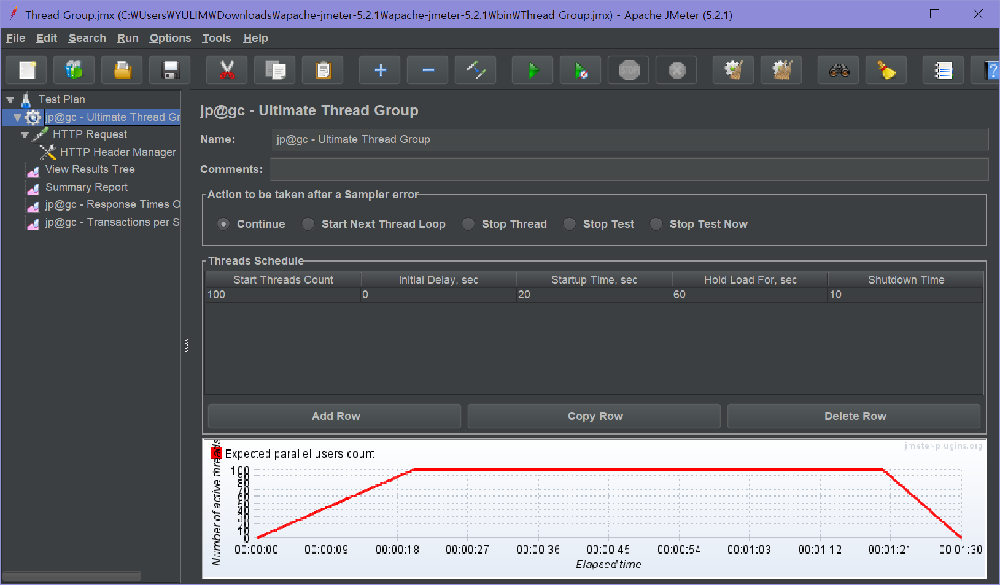

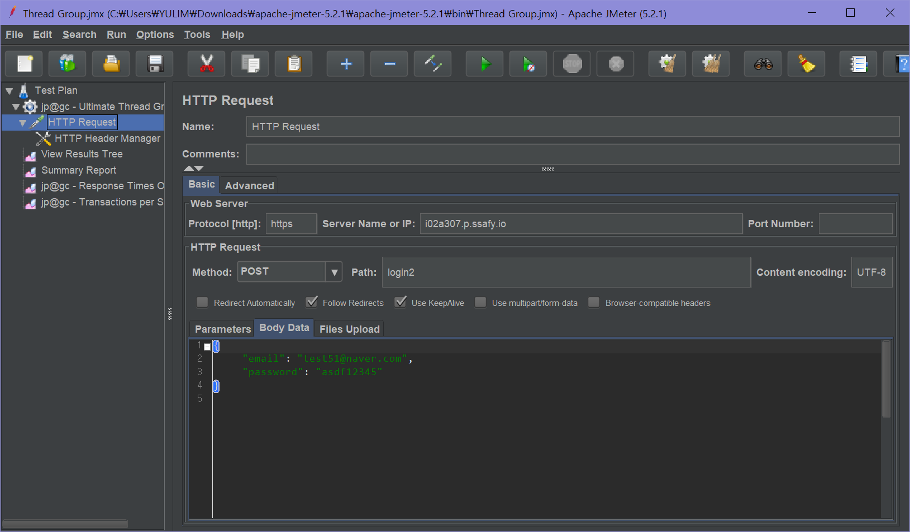

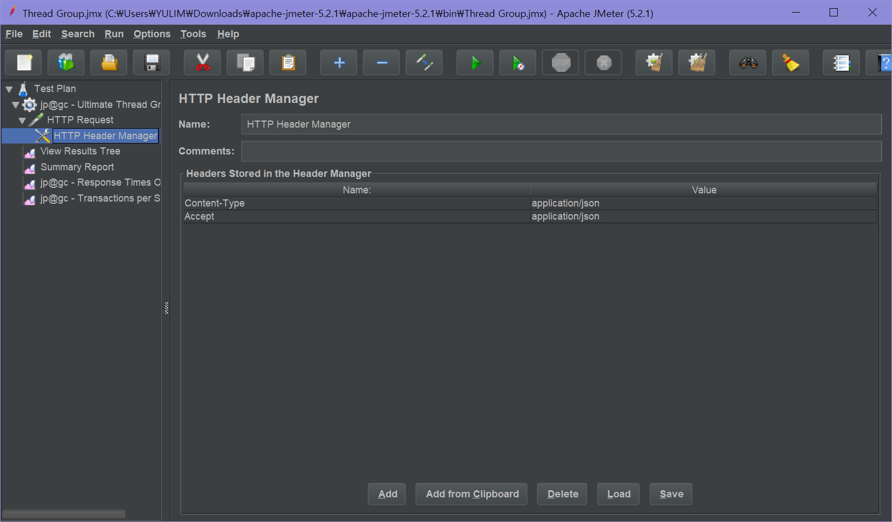

* start

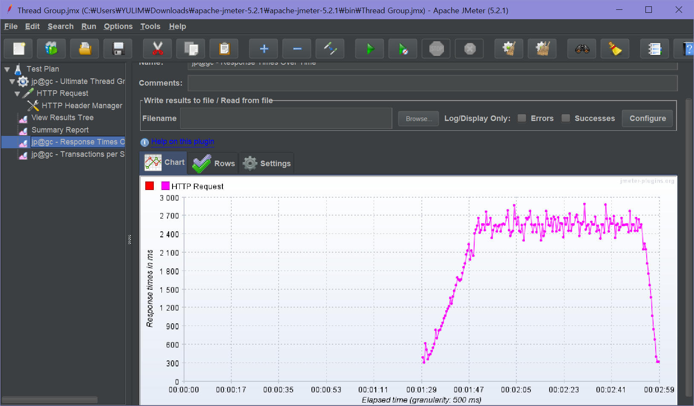

뭔가 잘못 나온다.

빗자루로 다 지우고 다시 해 보았더니

* Threads 300 - success

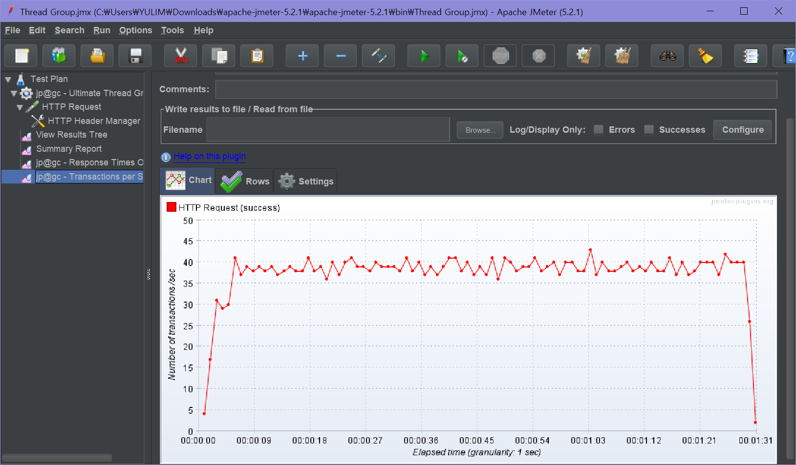

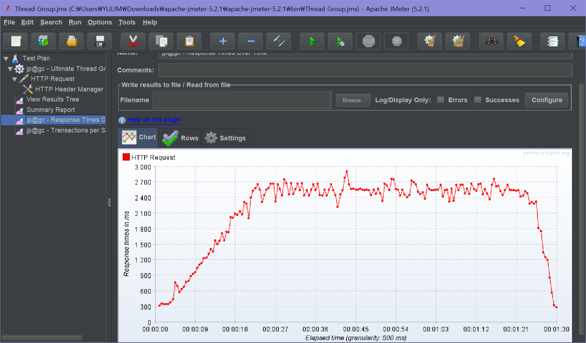

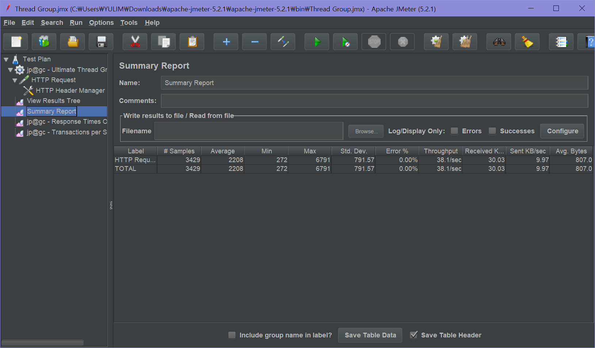

* Threads 1500 - success

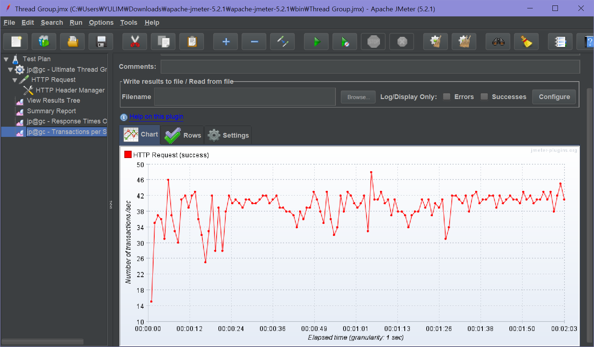

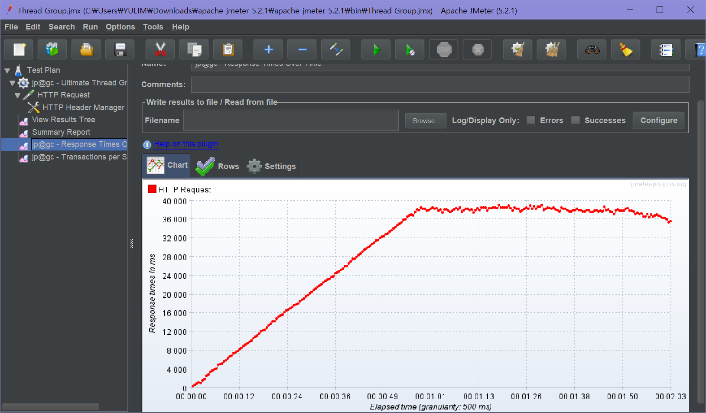

* Thread 3000 - success

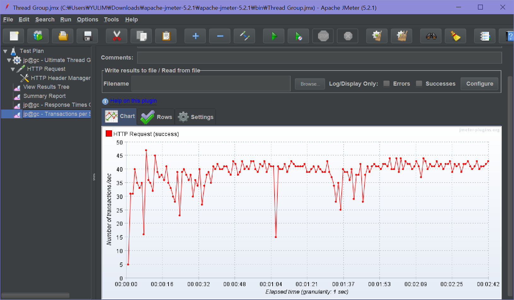

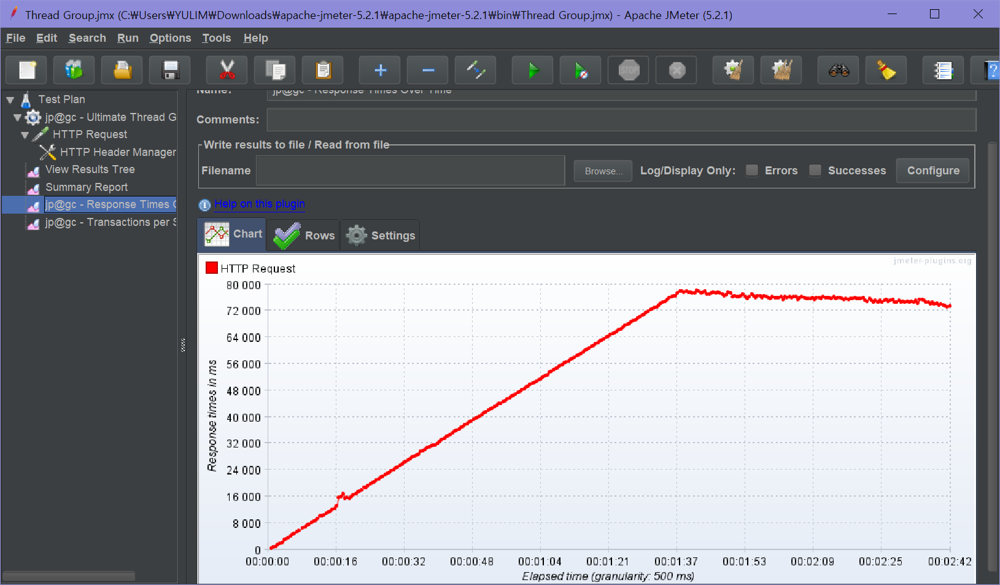

* Thread 4000

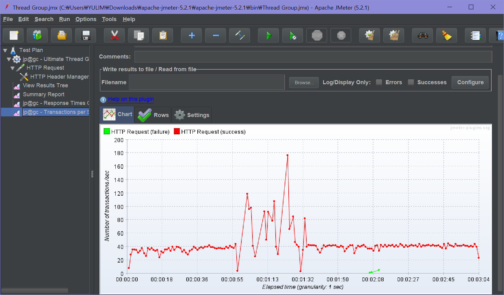

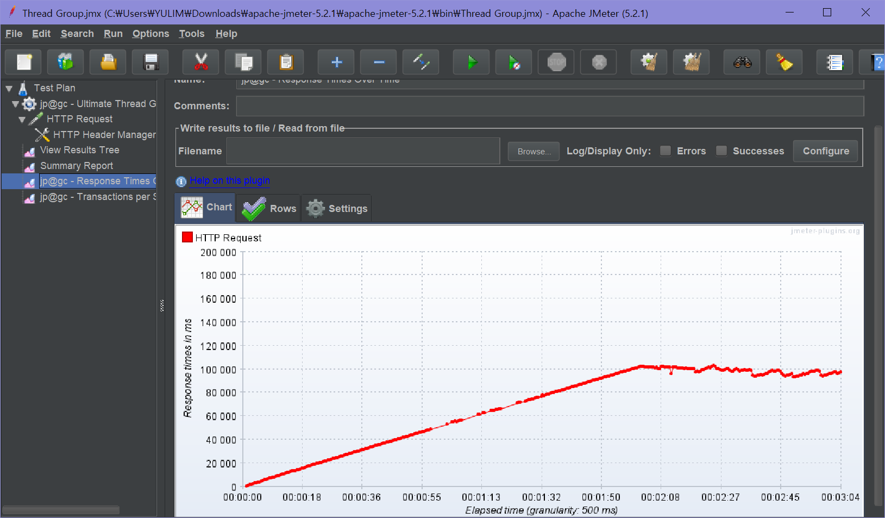

* Thread 5000

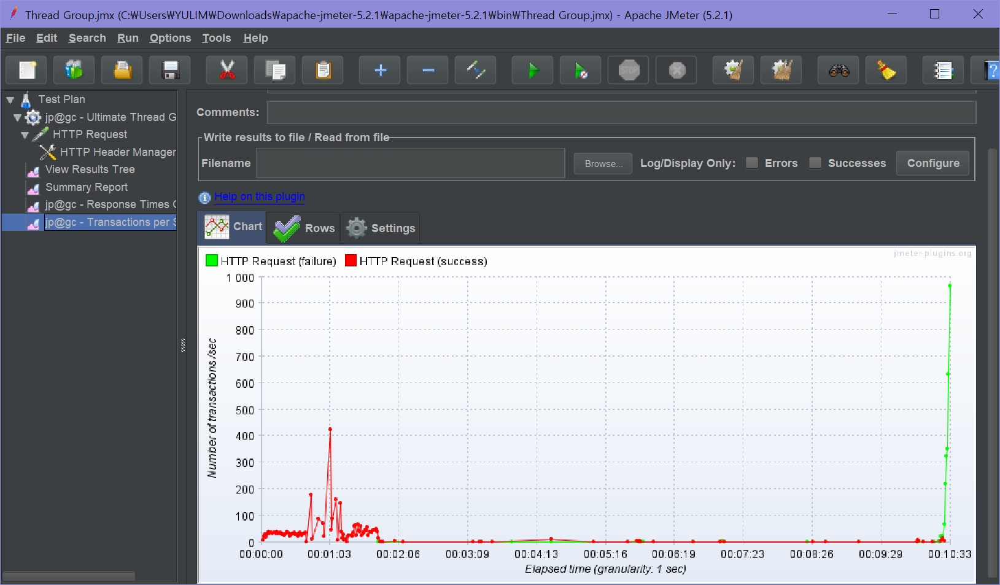

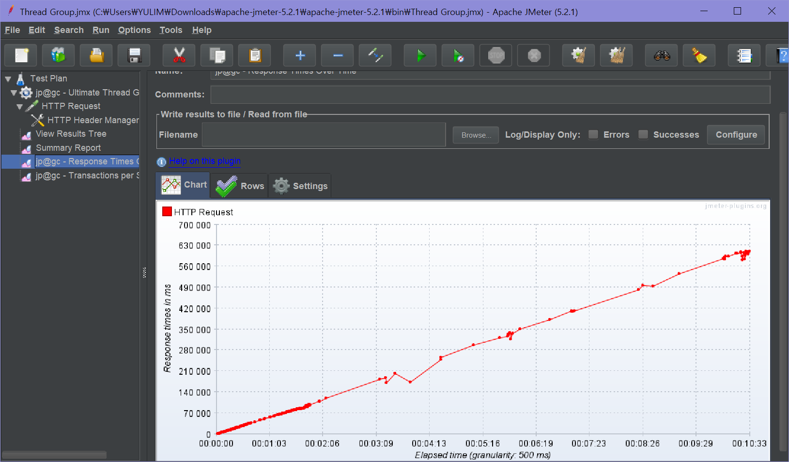

4000 이상부터 조금씩 fail이 발생

