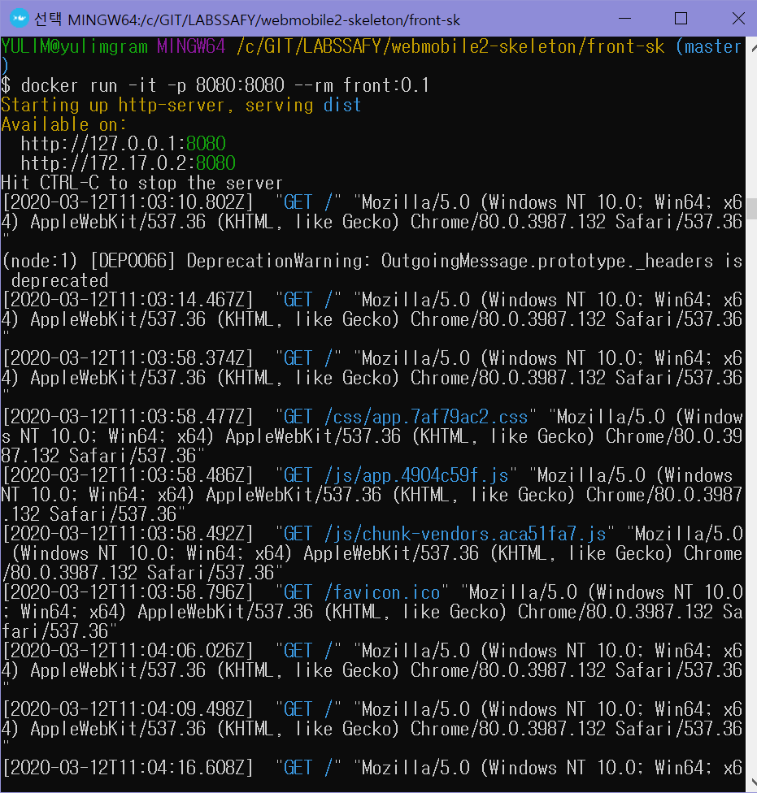
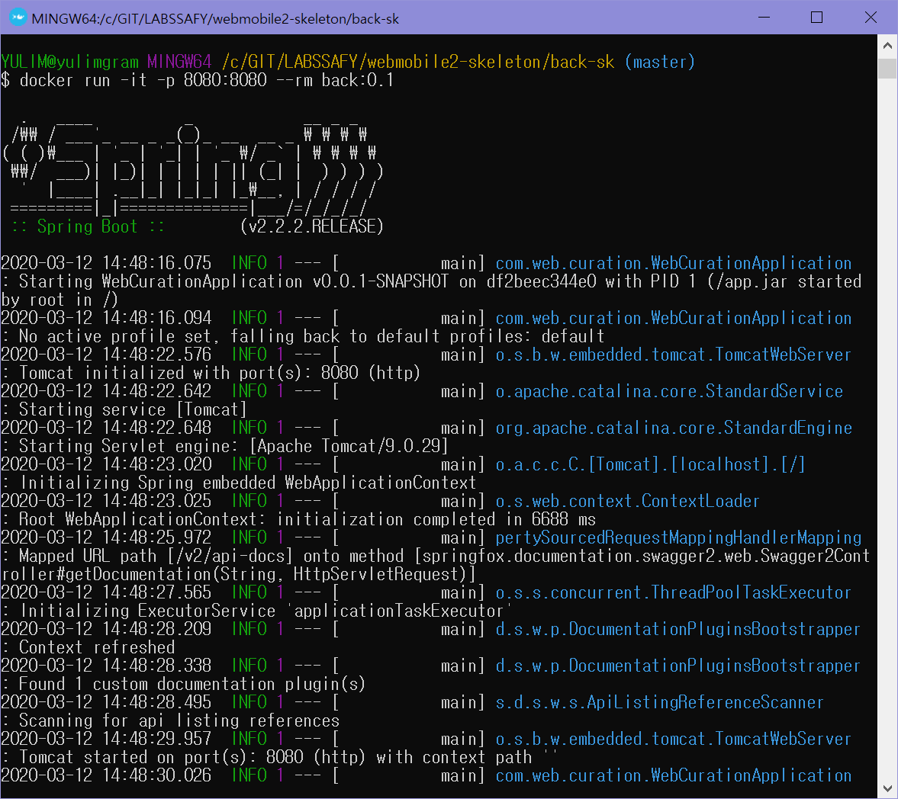

window10 education 이라서 docker toolbox를 설치함.

https://gwonsungjun.github.io/articles/2018-01/DockerInstall

고래 귀엽당 ㅎㅎ 버전 확인

어떤 컨테이너들이 깔려 있는지 확인, 지워보기!

jenkins 실습

포트 포워딩 해줘야 함 - Oracle VM VirtualBox에서 

docker-machine stop default | docker-machine start default

비번 입력하고 뭘 설치 하는데 안 되서 그냥 컨티뉴 했다..

Skeleton 코드 기반 프론트 도커 이미지 제작

Skeleton 코드 기반 백 도커 이미지 제작

