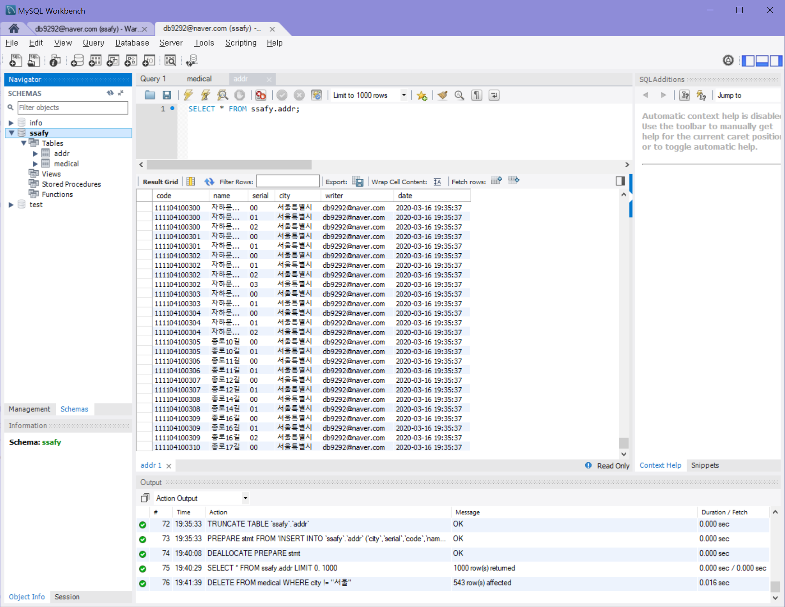
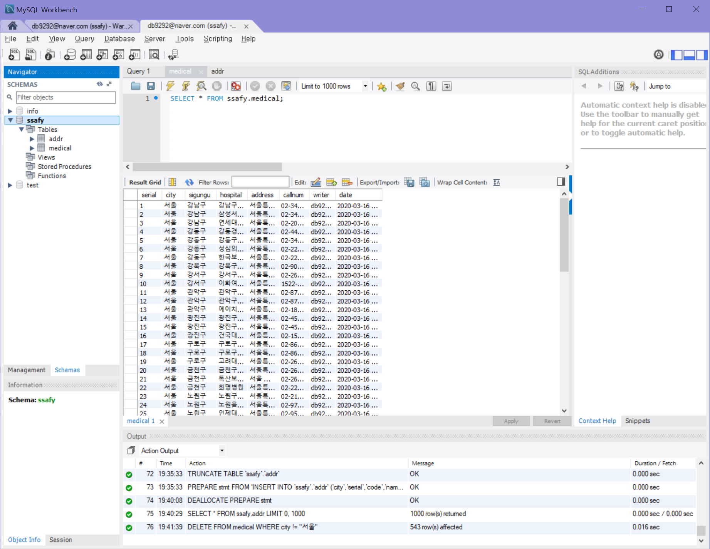

* Query

```sql
CREATE TABLE addr (
code varchar(24) NOT NULL,
name varchar(80),
serial varchar(4),
city varchar(20),
writer varchar(40) DEFAULT 'db9292@naver.com',
date DATETIME DEFAULT CURRENT_TIMESTAMP
)

CREATE TABLE medical (
serial integer NOT NULL,
city varchar(20),
sigungu varchar(20),
hospital varchar(40),
address varchar(80),
callnum varchar(40),
writer varchar(40) DEFAULT 'db9292@naver.com',
date DATETIME DEFAULT CURRENT_TIMESTAMP,
PRIMARY KEY ("serial")
)

DELETE FROM medical WHERE city != "서울"
```






