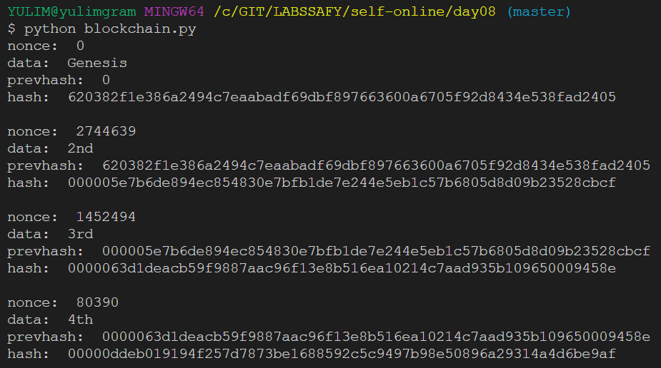

- 블록 만들기

```python
class Block:
    def __init__(self, index, timestamp, data):
        self.index = index
        self.timestamp = timestamp
        self.data = data
        self.previousHash = 0
        self.nonce = 0
        self.hash = self.calHash()

    def calHash(self):
        return hashlib.sha256(str(self.index).encode() + str(self.data).encode() + str(self.nonce).encode() +
            str(self.timestamp).encode() + str(self.previousHash).encode()).hexdigest()

    def mine(self, difficulty):
        ans = ['0'] * difficulty
        answer = ''.join(ans)
        while (str(self.hash)[:difficulty] != answer):
            self.nonce += 1
            self.hash = self.calHash()
        return self.hash
```

init 생성자를 통해 Block 객체가 생성될 때 초기화 해 준다.

calHash()를 통해 해시 값을 생성한다. 파이썬에서는 sha256을 hashlib에서 제공하고 있다. byte 데이터 타입이 들어갈 수 있기 때문에 string으로 변환 후 encode로 변환하고 16진수로 표현하기 위해 hexdigest를 사용한다.

mine()에서는 해시의 0-4 index 값을 0으로 맞춰주기 위해 해시를 맞춰 줬을 때 블록이 생성되게 한다. difficulty 값에 따라 해시에서 해당 인덱스까지의 값이 모두 0인 해시를 찾고, 아닐 경우 nonce 값을 올리며 반복한다.


- 체인 만들기

```python
class BlockChain:
    def __init__(self):
        self.chain = []
        self.difficulty = 5
        self.createGenesis()

    def createGenesis(self):
        value = Block(0, time.time(), 'Genesis')
        self.chain.append(value)
        print(
            'nonce: ', value.nonce,
            '\ndata: ', value.data,
            '\nprevhash: ', value.previousHash,
            '\nhash: ', value.hash
            )
        print()

    def addBlock(self, nBlock):
        nBlock.previousHash = self.chain[len(self.chain)-1].hash
        nBlock.hash = nBlock.mine(self.difficulty)
        self.chain.append(nBlock)
        print(
            'nonce: ', nBlock.nonce,
            '\ndata: ', nBlock.data,
            '\nprevhash: ', nBlock.previousHash,
            '\nhash: ', nBlock.hash
            )
        print()

    def isValid(self):
        i = 1
        while (i < len(self.chain)):
            if self.chain[i].hash != self.chain[i].calHash():
                return False
            if self.chain[i].previousHash != self.chain[i-1].hash:
                return False
            i += 1
        return True
```

createGenesis() 함수로 최초의 블록을 만든다. 이전 블록과의 연결을 통해 블록체인이 이루어지는데 최초의 블록은 이전 블록이 없으므로 이전 해시값도 없다. 

addBlock() 함수로 생성된 블록을 체인에 추가한다. 이 때는 이전 블록의 해시 값과 현재 블록의 해시 값을 계산하고 저장해야 한다. 

chain에 블록을 추가할 때 print로 출력한다.

isValid() 함수는 첫 번째 if에서 현재 블록의 해시 값과 계산된 해시 값을 비교하고 두 번째 if에서 현재 블록이 가지고 있는 이전 블록의 해시 값과 이전 블록에 저장되어 있는 해시 값을 비교한다.


- 실행

```python
onion = BlockChain()
onion.addBlock(Block(len(onion.chain), time.time(), '2nd'))
onion.addBlock(Block(len(onion.chain), time.time(), '3rd'))
onion.addBlock(Block(len(onion.chain), time.time(), '4th'))
```




- 해시함수를 활용한 사례
  - 검색
    - 해시테이블 자료구조에 사용 : 큰 파일에서 중복되는 레코드를 찾을 수 있기 때문에 데이터베이스 검색이나 테이블 검색의 속도를 가속할 수 있다. 
    - DNA  sequence에서 유사한 패턴을 찾는 데 사용할 수 있다.
    - 암호학
        - 암호용 해시 함수는 매핑된 해싱 값만을 알아서는 원래 입력 값을 알아내기 힘들다.
        - 전송된 데이터의 무결성을 확인해주는 데 사용된다. 메시지가 누구에게서 온 것인지 입증해주는 HMAC를 구성하는 블록으로 사용된다.