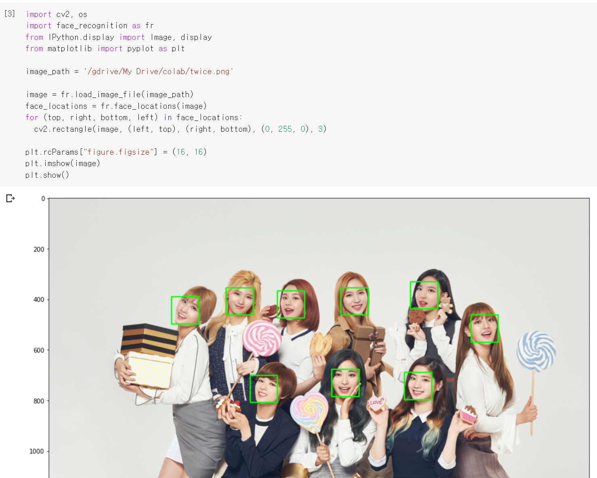

* Colab

Jupyter Notebook에 추가로 Python 소스코드를 Google의 클라우드 컴퓨팅 환경에서 GPU와 TPU를 무료로 사용할 수 있고, 소스코드나 데이터를 Google Drive를 통해 불러오거나 저장할 수 있는 개발 환경. Cloud 기반이므로 별도의 설치과정이 필요 없고 딥러닝, M/L, 데이터 사이언스 분야에서 사용되고 있다.

- Face Detection

- Face Recognition

얼굴 인식 후 감지된 부분을 잘라내어 리스트에 저장

새로운 얼굴을 잘라내어 unknown_face에 저장하고 인코딩한다

이 단계에서 어떤 사진을 넣었을 때 알 수 없는 오류가 발생했는데 

잘 모르겠다..

일반적으로 distance가 0.6 이상이면 타인, 비슷한 사람은 0.5대가 나오기도 한다고 하는데.. 닮았나?

내 사진을 unknown에 넣고 다른 사람 사진을 반대로 해 보았는데

.......AI는 아직 멀었다
