## 🤞인공지능 프로젝트 - 이미지 캡셔닝 활용 시스템

### Sub PJT 1 인공지능 기초 및 데이터 전처리


    


먼저 venv 가상환경을 만들고 tensorflow 및 필요 패키지들을 설치한다.

```bash
$ python -m venv venv
$ source venv/Scripts/activate
(venv)
$ pip install tensorflow==2.0.0 tensorflow-gpu==2.0.0
$ pip install matplotlib scikit-learn tqdm scipy numpy
```


#### Req 1. 단순 선형 회귀 모델 구현

`linear_regression.py`

```python
import tensorflow as tf
import numpy as np
import matplotlib.pyplot as plt
from models.linear_model import LinearModel
```

- tensorflow

텐서플로우는 다양한 작업에 대해 데이터 흐름 프로그래밍을 위한 오픈소스 소프트웨어 라이브러리이다.

심볼릭 수학 라이브러리이자, 뉴럴 네트워크같은 기계학습 응용프로그램에도 사용된다.


- numpy

넘파이는 행렬이나 일반적으로 대규모 다차원 배열을 쉽게 처리할 수 있도록 지원하는 파이썬의 라이브러리이다.

데이터 구조 외에도 수치 계산을 위해 효율적으로 구현된 기능을 제공한다.


- matplotlib.pyplot

파이썬에서 매트랩과 유사한 그래프 표시를 가능하게 하는 라이브러리이다.


- models.linear_model.LinearModel

이게 .......... 선형 모델을 쓸 수 있게 해 주는 거겠지 .. ?


```python
# 데이터 불러오기
train_data = np.load(".\\datasets\\linear_train.npy")
test_x = np.load(".\\datasets\\linear_test_x.npy")
```

np.load()라는 명령어로 npy, npz 파일을 읽어와서 사용할 수 있다.


```python
# tf 형식에 맞게 변환
x_data = np.expand_dims(train_data[:,0], axis=1)
y_data = train_data[:,1]
```

expand_dims ... 차원을 추가하는 함수.


```python
# 모델 생성
model = LinearModel(num_units=1)
```


```python
# 최적화 함수, 손실함수와 모델 바인딩 (학습 준비)
model.compile(optimizer=tf.keras.optimizers.SGD(learning_rate=0.001),
			  loss=tf.keras.losses.MSE,
			  metrics=[tf.keras.metrics.MeanSquaredError()])
```

- keras

머신러닝 모델을 만들고 훈련하기 위한 고수준 API이며 텐서플로의 특수 기능을 모두 지원한다.

층(layer)을 조합하여 모델(model)을 만든다. 모델은 일반적으로 층의 그래프이다.


- optimizer

훈련 과정을 설정한다. Adam / SGD 같은 옵티마이저 객체를 전달한다. 문자열 지정 가능

데이터와 손실 함수를 바탕으로 모델의 업데이트 방법을 결정한다.


- loss

최적화 과정에서 최소화될 손실 함수를 설정한다. 평균제곱오차(MSE) / 'categorical_crossentropy'/ 'binary_crossentropy' 등이 사용된다.

훈련하는 동안 모델의 오차를 측정한다. 모델의 학습이 올바른 방향으로 향하도록 이 함수를 최소화하는 것이 좋다.


- metrics

훈련 단계와 테스트 단계를 모니터링하기 위해 사용된다. 5.심화 예제에서는 올바르게 분류된 이미지의 비율인 정확도를 사용한다.


```python
# 모델 학습
model.fit(x=x_data, 
		  y=y_data, 	
		  epochs=10, 
		  batch_size=32)
```

- epochs

전체 입력 데이터를 한 번 순회하는 횟수를 말한다. (작은 배치로 나누어 수행된다)

epochs=40 이라면 전체 데이터를 40번 사용해서 학습을 거친다는 것을 의미한다.

epoch값이 너무 작다면 underfitting이 너무 크다면 overfitting이 발생활 확률이 높다.


- batch_size

넘파이 데이터를 전달하면 모델은 데이터를 작은 배치로 나누고 훈련 과정에서 이 배치를 순회한다. 

한 번의 batch마다 주는 데이터 샘플의 size를 말한다. batch(=mini-batch)는 나눠진 데이터 셋을 뜻함


- iteration

epoch를 나누어 실행하는 횟수를 말한다.

메모리의 한계와 속도 저하 때문에 대부분의 경우에는 한 번의 epoch에서 모든 데이터를 한꺼번에 사용할 수 없다. 그래서 iteration 수 만큼 나누어 주게 된다. 이 때의 데이터 사이즈가 batch_size이다.

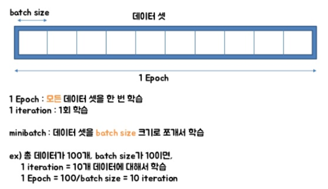


```python
# 모델 테스트
prediction = model.predict(x=test_x,
    					   batch_size=None)
```

- predict

주어진 데이터로 추론 모드에서 마지막 층의 출력을 예측하여 넘파이 배열로 반환한다.


```python
# 결과 시각화
plt.scatter(x_data, y_data, s=5, label="train data")
plt.scatter(test_x,prediction,s=5,label="prediction data")
plt.show()
```

scatter()로 그리며

show()로 출력

legend() : 범주

xlim(), ylim() : 범위


```python
# 모델 정리
model.summary()
```


코드를 실행하면 아래와 같은 그래프가 나온다

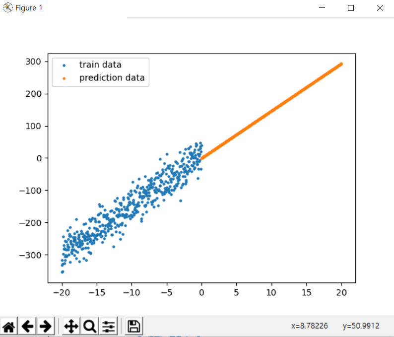


#### Req 2. 이미지 캡셔닝 Configuration

- 이미지 캡셔닝이란?

Caption이란 사진이나 삽화에 붙인 설명을 의미한다. 컴퓨터 비전에서 image captioning이란 컴퓨터가 사진을 보고 적절한 설명을 자동으로 붙이는 것을 의미한다. 따라서 image captioning 알고리즘의 입력은 이미지가 되고, 출력은 문장이 된다.


이미지 캡셔닝을 시작하기 전에, 파이썬 내장 함수인 argparse를 이용해 함수 실행 시 인자 값을 줄 수 있게 구성하려고 한다. 

2-1 `config.py` 파일 구현

```python
import argparse

parser = argparse.ArgumentParser()
parser.add_argument('--caption_file_path', type=str, default='./datasets/captions.csv')
parser.add_argument('--image_file_path', type=str, default='./datasets/images/')
parser.add_argument('--saved_dataset', type=str, default='test')
parser.add_argument('--do_sampling', type=str, default='10')

config = parser.parse_args()
```

모델 구현에 필요한 세팅 값들이 저장됨. 파일 경로, 입력 변수 등을 지정해줄 수 있다.


2-2 세팅 값 저장

configuration 변수들은 추후 다양하게 바꿔가며 실험되기 때문에 `train.py`를 실행할 때마다 당시의 세팅 값들을 저장하는 함수를 구현한다.

`utils.py`

```python
import matplotlib.pyplot as plt
from matplotlib.image import imread
from config import config
from datetime import datetime
import csv

# Req. 2-2	세팅 값 저장
def save_config():
	log = open('log_config.csv', 'a', newline='')
	csvwriter = csv.writer(log, delimiter=',')
	csvwriter.writerow([datetime.now(), config.caption_file_path, config.image_file_path, config.do_sampling, config.saved_dataset])
	log.close()
```


#### Req 3. 이미지 캡셔닝 데이터 전처리

`preprocess.py`

```python
import csv
import numpy as np
from sklearn.model_selection import train_test_split
```


3-1 이미지 경로 및 캡션 불러오기

```python
def get_path_caption():
    csv_data = np.loadtxt('./datasets/captions.csv', delimiter='|', dtype=np.str)
    csv_data = np.delete(csv_data, 0, 0)

    image_name = []
    comment = []
    for row in csv_data:
        img = row[0].strip('\"')
        image_name.append(img)
        comm = row[-1].strip(',').strip()
        comment.append(comm)
        
    return [image_name, comment]
```

np.loadtxt 함수를 사용해 구분자를 '|'로, dtype을 np.str으로 받아왔다.

csv_data에서 header를 빼고 싶어 처음엔 배열처럼 생각하고 pop을 했다가 에러 발생

np.delete(arr, obj(row or column number), axis) 로 0인덱스 데이터 제거

image_name, comment 배열에 각각 append 했다.

img에는 ", comment에는 ',,,,,,,' 와 공백이 붙어 나와서 strip 해 주었다.


`딕셔너리로는 이렇게 해 보았다.

```python
	result = {}
    for row in csv_data:
        comment = row[-1].strip(',').strip()
        if bool(result.get(row[0])) == False:
            result[row[0]] = [comment]
        else:
            result[row[0]].append(comment)
    return result
```


3-2 전체 데이터셋을 분리해 저장하기

- 전체 데이터를 학습용 및 테스트용 데이터로 분리하는 이유

머신러닝 모델에 train 데이터를 100% 학습시킨 후 test 데이터에 모델을 적용했을 때 성능이 생각보다 안 나오는 경우가 많다. 이런 현상을 overfitting 되었다 라고 한다. 즉, 모델이 내가 가진 학습 데이터에 과적합되어, 다른 케이스에는 예측율이 떨어지는 것이다. 이런 overfitting을 방지하는 것이 전체 모델 성능을 따져보았을 때 매우 중요한 프로세스이다.


```python
def dataset_split_save(dataset):
    train_x, test_x, train_y, test_y = train_test_split(dataset[0], dataset[1], shuffle=False)
```

train_test_split(array*, test_size, train_size, random_state, shuffle, stratify)

데이터들을 필수 인자 값으로 받는다. list, arrays, matrics, dataframe 등 다양한 형태를 포함한다. 클래스 값을 포함하여 하나의 데이터로 받거나 클래스 값을 분리해서 두 개의 데이터로도 받을 수 있다.

test_size는 float, int, None 값이다. float은 전체 데이터 셋에서 testset의 비율을 의미한다. int는 데이터 개수를 의미한다. 기본 값은 0.25이다.

train_size는 test_size와 같지만 전체 데이터 셋에서 trainset의 양을 의미한다. 기본 값은 None이다.

random_state는 int, randomstate instance, None 값이다. int는 숫자를 랜덤하게 생성할 때 사용되는 seed 숫자로 사용된다. None을 입력하면 np.random에서 제공하는 random number generator가 사용된다.

shuffle은 bool 값으로 데이터를 분리하기 전에 데이터를 섞을 것인지 지정하며 기본값은 True이다.

stratify는 훈련/테스트 데이터들이 원래의 input dataset의 클래스와 같은 비율을 가지도록 할 것인지 지정한다. 


```python
# print(len(train_x), train_x[:5], '\n')
# print(len(test_x), test_x[:5], '\n')
# print(len(train_y), train_y[:5], '\n')
# print(len(test_y), test_y[:5], '\n')
```

`shuffle=True` 일 때 (기본값)


`shuffle=False` 를 주면 아래와 같다

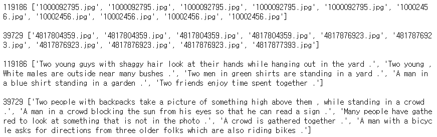


```python
np.savez('./datasets/test_dataset.npz', x=test_x, y=test_y)
np.savez('./datasets/train_dataset.npz', x=train_x, y=train_y)
```

npy는 하나의 데이터를 저장할 때, npz는 복수의 파일을 key-value pair형태로 저장할 때

이렇게 저장하면 binary형태로 저장이 되어서 훨씬 적은 용량을 차지한다.


3-3 저장된 데이터셋 불러오기

처음에 명세를 잘못 이해하고 이런 걸 짰다...

```python
def get_data_file(inp):
    if inp != 'train_x' and inp != 'test_x' and inp != 'train_y' and inp != 'test_y':
        return print('제대로 입력하셈')
    if inp[:4] == 'test':
        data = np.load('../datasets/test_dataset.npz')
        if inp[-1] == 'x':
            return print(data['x'])
        else:
            return print(data['y'])
    else:
        data = np.load('../datasets/train_dataset.npz')
        if inp[-1] == 'x':
            return print(data['x'])
        else:
            return print(data['y'])
```

아래 코드로  수정!

```python
def get_data_file(inp):
    if inp != 'train' and inp != 'test':
        return print('제대로 입력하셈')
    data = np.load(f'./datasets/{inp}_dataset.npz')

    result = {}
    img = data['x']
    comment = data['y']
    img_stan = img[0]
    idx = 1
    del_list = [0]

    while img != []:
        if idx >= len(img):
            break
        if img[idx] == img_stan:
            del_list.append(idx)
            idx += 1
        else:
            del_list.append(idx)
            com_list = []
            for com in comment[:idx]:
                com_list.append(com)
            result[img[idx]] = com_list
            img = np.delete(img, del_list, 0)
            comment = np.delete(comment, del_list, 0)
            img_stan = img[0]
            idx = 1
            del_list = [0]
    return result
```

inp값으로 어떤 데이터를 불러올 지 정할 수 있게 했고

이미지 이름에 여러 캡션이 들어가기 때문에 dict 형태로 key에 name, value에 caption을 list로 넣어 return했다.

test_dataset의 결과는 다음과 같다.

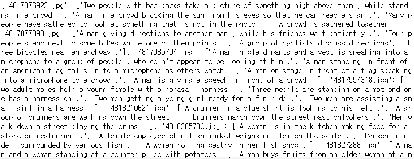


3-4 데이터 샘플링

```python
def sampling_data(rate):
    img, com = get_path_caption()
    
    dataset = []
    for i in range(len(img)):
        dataset.append(img[i] + ', ' + com[i])
    
    return np.random.choice(dataset, size=int(len(img) * float(rate) / 100), replace=False).tolist()
```

처음에 받아왔던 데이터셋을 사용한다. random.choice를 쓰기 위해서는 차원을 없앤다.


실행 코드 ! 이것도 `train.py`의 존재를 알기 전 ......^~^

```python
dataset_split_save(get_path_caption())
print('train, test')
res = get_data_file(input())
print('size?')
sampling_data(input())
```


#### Req 4. 이미지와 캡션 시각화

이미지 파일과 캡션을 입력으로 받아 이를 시각화하는 함수를 구현한다.

이 프로젝트 실행하는 방법을 이제서야 제대로 알게 됐고, 또 `config.py`를 사용해서 미리 저장해놓은 설정을 사용해보게 되어 코드 수정을 좀 했다.!

`train.py`

```python
from config import config
from data import preprocess
from utils import utils

# config 저장
utils.save_config()

# 이미지 경로 및 캡션 불러오기
image_info = preprocess.get_path_caption()

# 전체 데이터셋을 분리해 저장하기
preprocess.dataset_split_save(image_info)

# 저장된 데이터셋 불러오기
dataset_dict = preprocess.get_data_file(config.saved_dataset)

# 데이터 샘플링
dataset_sampling = preprocess.sampling_data(config.do_sampling)

# 이미지와 캡션 시각화 하기
utils.visualize_img_caption(dataset_sampling)
```

```python
def visualize_img_caption(dataset):
	img, com = '', ''
	for data in dataset:
		for s in range(len(data)):
			if data[s] == '|':
				img = data[:s]
				com = data[s+1:]
                
		addr = imread(config.image_file_path + img)
		plt.imshow(addr)
		plt.title(f'<start>{com}<end>')
		plt.show()
```

샘플링 된 string 데이터에서 '|' 로 구분되어 있는 이미지와 캡션을 분리하여 하나씩 받아온다.

plt.imshow()를 사용하여 이미지를 출력할 수 있다. (pip install pillow)

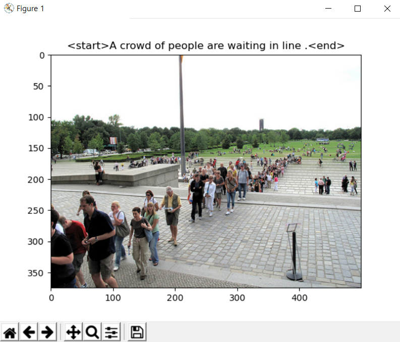


#### Req 5.Fashion MNIST 분류 모델 구현

5-1 Fashion MNIST 데이터 다운 및 시각화

```python
from __future__ import absolute_import, division, print_function, unicode_literals, unicode_literals

import tensorflow as tf
from tensorflow import keras

import numpy as np
import matplotlib.pyplot as plt

print(tf.__version__)
```

    2.0.0

```python
# 패션 MNIST 데이터셋 임포트
fashion_mnist = keras.datasets.fashion_mnist
# load_data() 함수를 호출하면 아래 4개의 넘파이 배열이 반환됨
(train_images, train_labels), (test_images, test_labels) = fashion_mnist.load_data()
```


```python
# 데이터셋에 클래스 이름이 들어있지 않기 때문에 별도의 변수를 만들어 지정
class_names = ['T-shirt/top', 'Trouser', 'Pullover', 'Dress', 'Coat', 
              'Sandal', 'Shirt', 'Sneaker', 'Bag', 'Ankle boot']
```


```python
test_images.shape
```


    (10000, 28, 28)


```python
plt.figure()
plt.imshow(train_images[0])
plt.colorbar()
plt.grid(False)
plt.show()
```


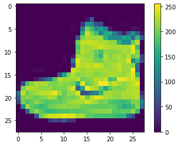

```python
# 픽셀 값의 범위가 0-255임. 이 값의 범위를 0-1 사이로 조정하겠음.
train_images = train_images / 255.0
test_images = test_images / 255.0
```


```python
# 훈련 데이터 포맷이 올바른지 확인하고 네트워크 구성과 훈련할 준비
plt.figure(figsize=(10, 10))
for i in range(25):
    plt.subplot(5, 5, i+1)
    plt.xticks([])
    plt.yticks([])
    plt.grid(False)
    plt.imshow(train_images[i], cmap=plt.cm.binary)
    plt.xlabel(class_names[train_labels[i]])
plt.show()

```


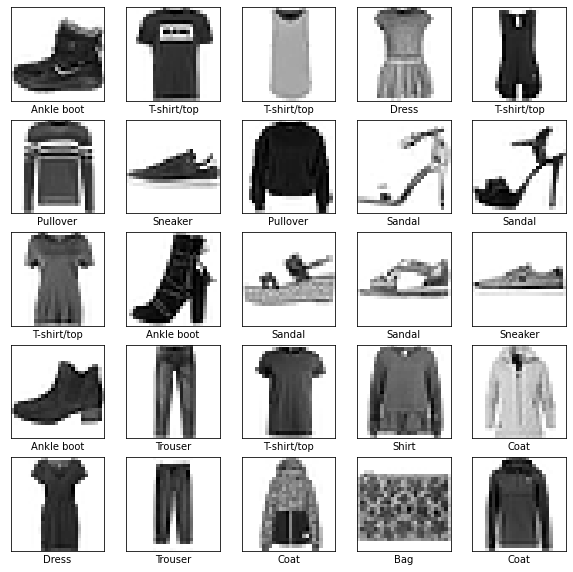


5-2 인공신경망 구현 및 컴파일

  모델 구성, 층 설정

- 신경망의 구성 요소는 층(layer)이다. 층은 주입된 데이터에서 표현을 추출한다. 문제를 해결하는 데 더 의미있는 표현이 추출될 것이다.
- 대부분의 딥러닝은 간단한 층을 연결하여 구성된다.
- tf.keras.layers.Dense 와 같은 층들의 가중치는 훈련하는 동안 학습된다.


```python
model = keras.Sequential([
    keras.layers.Flatten(input_shape=(28, 28)),
    keras.layers.Dense(128, activation='relu'),
    keras.layers.Dense(10, activation='softmax')
])
```

이 네트워크의 첫 번째 층인 tf.keras.layers.Flatten 은 2차원 배열(28\*28)의 이미지 포맷을 28*28=784 의 1차원 배열로 변환한다. 이 층은 이미지에 있는 픽셀의 행을 펼쳐서 일렬로 늘린다. 이 층에는 학습되는 가중치가 없고 데이터 변환만 한다.
픽셀을 펼친 후에 두 개의 tf.keras.layers.Dense 층이 연속되어 연결된다. 이 층을 밀집 연결(densely-connected) 또는 완전 연결(fully-connected) 층이라고 부른다.
첫 번째 Dense 층은 128개의 노드(또는 뉴런)를 가진다. 두 번째(마지막) 층은 10개의 노드의 소프트맥스층이다. 이 층은 10개의 확률을 반환하고 반환된 값의 전체 합은 1이다. 각 노드는 현재 이미지가 10개 클래스 중 하나에 속할 확률을 출력한다.


```python
# 모델 컴파일 : 모델을 훈련하기 전에 필요한 설정
model.compile(optimizer='adam',
             loss='sparse_categorical_crossentropy',
             metrics=['accuracy'])
```


5-3 모델 학습 및 테스트

  모델 훈련

1. 훈련 데이터를 모델에 주입한다. train_images, train_labels
2. 모델이 이미지와 레이블을 매핑하는 방법을 배운다.
3. 테스트 세트에 대한 모델의 예측을 만든다. test_images 배열. 이 예측이 test_labels 배열의 레이블과 맞는지 확인한다.


```python
model.fit(train_images, train_labels, epochs=10)
```

    Train on 60000 samples
    Epoch 1/10
    60000/60000 [==============================] - 3s 54us/sample - loss: 0.1962 - accuracy: 0.9262
    Epoch 2/10
    60000/60000 [==============================] - 3s 55us/sample - loss: 0.1922 - accuracy: 0.9276
    Epoch 3/10
    60000/60000 [==============================] - 3s 57us/sample - loss: 0.1892 - accuracy: 0.9286
    Epoch 4/10
    60000/60000 [==============================] - 3s 54us/sample - loss: 0.1841 - accuracy: 0.9297
    Epoch 5/10
    60000/60000 [==============================] - 3s 55us/sample - loss: 0.1792 - accuracy: 0.9322
    Epoch 6/10
    60000/60000 [==============================] - 3s 54us/sample - loss: 0.1747 - accuracy: 0.9337
    Epoch 7/10
    60000/60000 [==============================] - 3s 54us/sample - loss: 0.1712 - accuracy: 0.9352
    Epoch 8/10
    60000/60000 [==============================] - 3s 54us/sample - loss: 0.1678 - accuracy: 0.9364
    Epoch 9/10
    60000/60000 [==============================] - 3s 54us/sample - loss: 0.1639 - accuracy: 0.9373
    Epoch 10/10
    60000/60000 [==============================] - 5s 78us/sample - loss: 0.1586 - accuracy: 0.9414
    
    <tensorflow.python.keras.callbacks.History at 0x21b26ef3788>

- epochs 5일 때 훈련 세트에서 약 0.88 정도의 정확도 달성
- epochs 10일 때 훈련 세트에서 약 0.92 정도의 정확도 달성


```python
# 정확도 평가 : 그 다음 테스트 세트에서 모델의 성능을 비교한다.
test_loss, test_acc = model.evaluate(test_images, test_labels, verbose=2)
print('테스트 정확도: ', test_acc)
```

    10000/1 - 0s - loss: 0.2639 - accuracy: 0.8884
    테스트 정확도:  0.8884


- 테스트 세트의 정확도가 훈련 세트의 정확도보다 조금 낮다. 훈련 세트의 정확도와 테스트 세트의 정확도 사이의 차이는 overfitting 때문이다.


5-4 테스트 결과 시각화


```python
# 예측 만들기 : 훈련된 모델을 사용하여 이미지에 대한 예측 만들기
predictions = model.predict(test_images)
```


```python
# 테스트 세트에 있는 각 이미지의 레이블을 예측한다. 첫 번째 예측 확인
predictions[0]
```


    array([1.7601879e-13, 8.5432294e-15, 4.7925706e-16, 4.7869198e-18,
           6.7109355e-13, 2.1202037e-05, 1.6984966e-13, 3.3402473e-03,
           2.9903163e-13, 9.9663854e-01], dtype=float32)

- 10개의 옷 품목에 상응하는 모델의 신뢰도를 나타낸다.


```python
# 가장 높은 신뢰도를 가진 레이블 찾기
np.argmax(predictions[0])
```


    9

- 앵클 부츠(class_name[9])라고 가장 확신하고 있다.


```python
# 값이 맞는지 테스트 레이블 확인
test_labels[0]
```


    9


```python
# 10개 클래스에 대한 예측을 그래프로 표현하기
def plot_image(i, predictions_array, true_label, img):
    predictions_array, true_label, img = predictions_array[i], true_label[i], img[i]
    plt.grid(False)
    plt.xticks([])
    plt.yticks([])

    plt.imshow(img, cmap=plt.cm.binary)

    predicted_label = np.argmax(predictions_array)
    if predicted_label == true_label:
        color = 'blue'
    else:
        color = 'red'

    plt.xlabel("{} {:2.0f}% ({})".format(class_names[predicted_label],
                                100*np.max(predictions_array),
                                class_names[true_label]),
                                color=color)

def plot_value_array(i, predictions_array, true_label):
    predictions_array, true_label = predictions_array[i], true_label[i]
    plt.grid(False)
    plt.xticks([])
    plt.yticks([])
    thisplot = plt.bar(range(10), predictions_array, color="#777777")
    plt.ylim([0, 1])
    predicted_label = np.argmax(predictions_array)

    thisplot[predicted_label].set_color('red')
    thisplot[true_label].set_color('blue')
```


```python
i = 0
plt.figure(figsize=(6,3))
plt.subplot(1,2,1)
plot_image(i, predictions, test_labels, test_images)
plt.subplot(1,2,2)
plot_value_array(i, predictions,  test_labels)
plt.show()
```


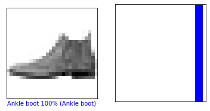

```python
i = 12
plt.figure(figsize=(6,3))
plt.subplot(1,2,1)
plot_image(i, predictions, test_labels, test_images)
plt.subplot(1,2,2)
plot_value_array(i, predictions,  test_labels)
plt.show()
```


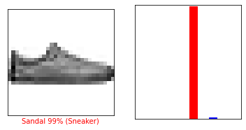

- 잘못 예측하고 있다. 그런데 학습을 더 시켜도 결과가 동일하다...

```python
# 처음 X 개의 테스트 이미지와 예측 레이블, 진짜 레이블을 출력합니다
# 올바른 예측은 파랑색으로 잘못된 예측은 빨강색으로 나타냅니다
num_rows = 5
num_cols = 3
num_images = num_rows*num_cols
plt.figure(figsize=(2*2*num_cols, 2*num_rows))
for i in range(num_images):
  plt.subplot(num_rows, 2*num_cols, 2*i+1)
  plot_image(i, predictions, test_labels, test_images)
  plt.subplot(num_rows, 2*num_cols, 2*i+2)
  plot_value_array(i, predictions, test_labels)
plt.show()
```


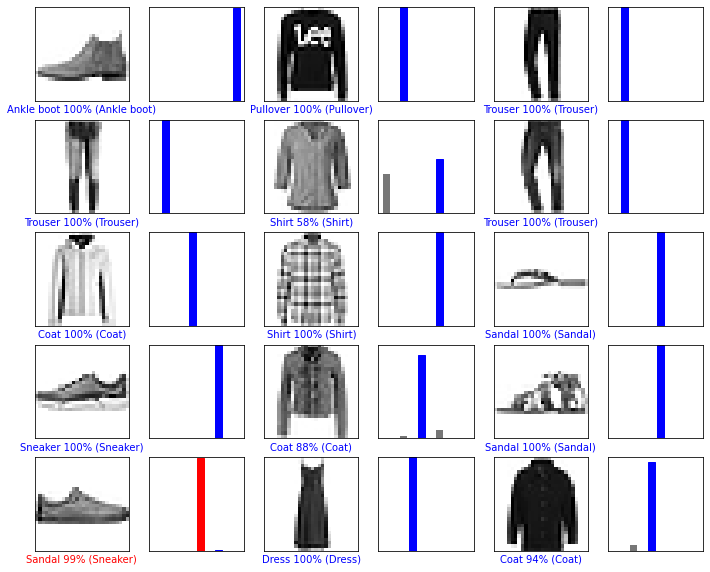

```python
# 테스트 세트에서 이미지 하나를 선택한다
img = test_images[0]
print(img.shape)
```

    (28, 28)

```python
# tf.keras 모델은 한 번에 샘플의 묶음 또는 배치로 예측을 만드는데 최적화되어있음
# 하나의 이미지를 사용할 때에도 2차원 배열로 만들어야 한다.
img = (np.expand_dims(img, axis=0))
print(img.shape)
```

    (1, 28, 28)

```python
# 이미지의 예측을 만든다
predictions_single = model.predict(img)
print(predictions_single)
```

    [[1.7601845e-13 8.5431963e-15 4.7925706e-16 4.7869016e-18 6.7109355e-13
      2.1202099e-05 1.6984999e-13 3.3402473e-03 2.9903163e-13 9.9663854e-01]]

```python
plot_value_array(0, predictions_single, test_labels)
_ = plt.xticks(range(10), class_names, rotation=45)
```


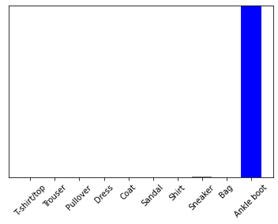

```python
np.argmax(predictions_single[0])
```


    9

