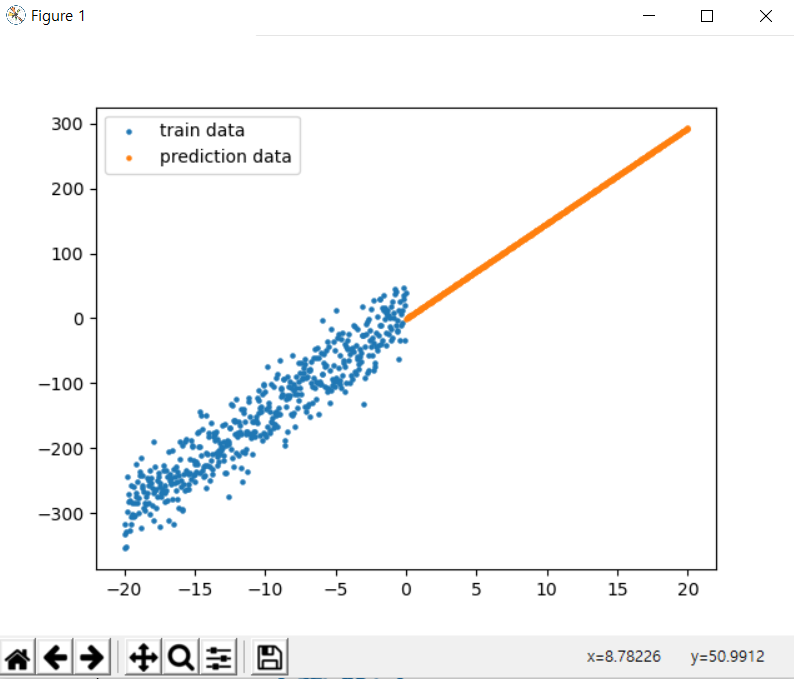

##### 1. 단순 선형 회귀 모델 구현

먼저 venv 가상환경을 만들고 tensorflow 및 필요 패키지들을 설치한다

```bash
$ python -m venv venv
$ source venv/Scripts/activate
(venv)
$ pip install tensorflow==2.0.0
$ pip install matplotlib scikit-learn tqdm scipy numpy tensorflow-gpu==2.0.0
```


linear regression 예제 코드 개념 정리

```python
import tensorflow as tf
import numpy as np
import matplotlib.pyplot as plt
from models.linear_model import LinearModel
```

- tensorflow

텐서플로우는 다양한 작업에 대해 데이터 흐름 프로그래밍을 위한 오픈소스 소프트웨어 라이브러리이다.

심볼릭 수학 라이브러리이자, 뉴럴 네트워크같은 기계학습 응용프로그램에도 사용된다.


- numpy

넘파이는 행렬이나 일반적으로 대규모 다차원 배열을 쉽게 처리할 수 있도록 지원하는 파이썬의 라이브러리이다.

데이터 구조 외에도 수치 계산을 위해 효율적으로 구현된 기능을 제공한다.


- matplotlib.pyplot

파이썬에서 매트랩과 유사한 그래프 표시를 가능하게 하는 라이브러리이다.


- models.linear_model.LinearModel

이게 .......... 선형 모델을 쓸 수 있게 해 주는 거겠지 .. ? 잘 모르겠다 ㅠㅠ


```python
# 데이터 불러오기
train_data = np.load(".\\datasets\\linear_train.npy")
test_x = np.load(".\\datasets\\linear_test_x.npy")
```

np.load()라는 명령어로 npy, npz 파일을 읽어와서 사용할 수 있다.


```python
# tf 형식에 맞게 변환
x_data = np.expand_dims(train_data[:,0], axis=1)
y_data = train_data[:,1]
```

expand_dims ... 차원을 추가한다................ 모르겠다..


```python
# 모델 생성
model = LinearModel(num_units=1)
```


```python
# 최적화 함수, 손실함수와 모델 바인딩 (학습 준비)
model.compile(optimizer=tf.keras.optimizers.SGD(learning_rate=0.001),
			  loss=tf.keras.losses.MSE,
			  metrics=[tf.keras.metrics.MeanSquaredError()])
```

- keras

머신러닝 모델을 만들고 훈련하기 위한 고수준 API이며 텐서플로의 특수 기능을 모두 지원한다.

층(layer)을 조합하여 모델(model)을 만든다. 모델은 일반적으로 층의 그래프이다.


- optimizer

훈련 과정을 설정한다. Adam / SGD 같은 옵티마이저 객체를 전달한다. 문자열 지정 가능

데이터와 손실 함수를 바탕으로 모델의 업데이트 방법을 결정한다.


- loss

최적화 과정에서 최소화될 손실 함수를 설정한다. 평균제곱오차(MSE) / 'categorical_crossentropy'/ 'binary_crossentropy' 등이 사용된다.

훈련하는 동안 모델의 오차를 측정한다. 모델의 학습이 올바른 방향으로 향하도록 이 함수를 최소화하는 것이 좋다.


- metrics

훈련 단계와 테스트 단계를 모니터링하기 위해 사용된다. 5.심화 예제에서는 올바르게 분류된 이미지의 비율인 정확도를 사용한다.


```python
# 모델 학습
model.fit(x=x_data, 
		  y=y_data, 
		  epochs=10, 
		  batch_size=32)
```

- epochs

전체 입력 데이터를 한 번 순회하는 횟수를 말한다. (작은 배치로 나누어 수행된다)

epochs=40 이라면 전체 데이터를 40번 사용해서 학습을 거친다는 것을 의미한다.

epoch값이 너무 작다면 underfitting이 너무 크다면 overfitting이 발생활 확률이 높다.


- batch_size

넘파이 데이터를 전달하면 모델은 데이터를 작은 배치로 나누고 훈련 과정에서 이 배치를 순회한다. 

한 번의 batch마다 주는 데이터 샘플의 size를 말한다. batch(=mini-batch)는 나눠진 데이터 셋을 뜻함


- iteration

epoch를 나누어 실행하는 횟수를 말한다.

메모리의 한계와 속도 저하 때문에 대부분의 경우에는 한 번의 epoch에서 모든 데이터를 한꺼번에 사용할 수 없다. 그래서 iteration 수 만큼 나누어 주게 된다. 이 때의 데이터 사이즈가 batch_size이다.


```python
# 모델 테스트
prediction = model.predict(x=test_x,
    					   batch_size=None)
```

- predict

주어진 데이터로 추론 모드에서 마지막 층의 출력을 예측하여 넘파이 배열로 반환한다.


```python
# 결과 시각화
plt.scatter(x_data, y_data, s=5, label="train data")
plt.scatter(test_x,prediction,s=5,label="prediction data")
plt.show()
```

scatter()로 그리며

show()로 출력

legend() : 범주

xlim(), ylim() : 범위


```python
# 모델 정리
model.summary()
```


실행하면 아래와 같은 그래프가 나온다

