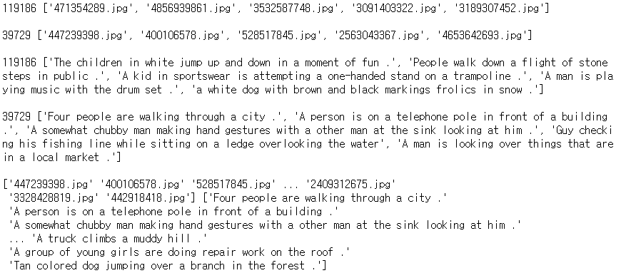

### 3. 이미지 캡셔닝 데이터 전처리

3-1 이미지 경로 및 캡션 불러오기

```python
def get_path_caption():
    csv_data = np.loadtxt('../datasets/captions.csv', delimiter='|', dtype=np.str)
    csv_data = np.delete(csv_data, 0, 0)

    image_name = []
    comment = []
    for row in csv_data:
        image_name.append(row[0])
        comm = row[-1].strip(',').strip()
        comment.append(comm)
        
    return [image_name, comment]
```

np.loadtxt 함수를 사용해 구분자를 '|'로, dtype을 np.str으로 받아왔다.

csv_data에서 header를 빼고 싶어 처음엔 배열처럼 생각하고 pop을 했다가 에러 발생

np.delete(arr, obj(row or column number), axis) 로 0인덱스 데이터 제거

image_name, comment 배열에 각각 append 했다.

comment에는 ',,,,,,,' 와 공백이 붙어 나와서 strip 해 주었다.


`딕셔너리로 수정

```python
	result = {}
    for row in csv_data:
        comment = row[-1].strip(',').strip()
        if bool(result.get(row[0])) == False:
            result[row[0]] = [comment]
        else:
            result[row[0]].append(comment)
    return result
```


3-2 전체 데이터셋을 분리해 저장하기

- 전체 데이터를 학습용 및 테스트용 데이터로 분리하는 이유

머신러닝 모델에 train 데이터를 100% 학습시킨 후 test 데이터에 모델을 적용했을 때 성능이 생각보다 안 나오는 경우가 많다. 이런 현상을 overfitting 되었다 라고 한다. 즉, 모델이 내가 가진 학습 데이터에 과적합되어, 다른 케이스에는 예측율이 떨어지는 것이다. 이런 overfitting을 방지하는 것이 전체 모델 성능을 따져보았을 때 매우 중요한 프로세스이다.


```python
def dataset_split_save(dataset):
    train_x, test_x, train_y, test_y = train_test_split(dataset[0], dataset[1])
```





train_test_split(array*, test_size, train_size, random_state, shuffle, stratify)

데이터들을 필수 인자 값으로 받는다. list, arrays, matrics, dataframe 등 다양한 형태를 포함한다. 클래스 값을 포함하여 하나의 데이터로 받거나 클래스 값을 분리해서 두 개의 데이터로도 받을 수 있다.

test_size는 float, int, None 값이다. float은 전체 데이터 셋에서 testset의 비율을 의미한다. int는 데이터 개수를 의미한다. 기본 값은 0.25이다.

train_size는 test_size와 같지만 전체 데이터 셋에서 trainset의 양을 의미한다. 기본 값은 None이다.

random_state는 int, randomstate instance, None 값이다. int는 숫자를 랜덤하게 생성할 때 사용되는 seed 숫자로 사용된다. None을 입력하면 np.random에서 제공하는 random number generator가 사용된다.

shuffle은 bool 값으로 데이터를 분리하기 전에 데이터를 섞을 것인지 지정하며 기본값은 True이다.

stratify는 훈련/테스트 데이터들이 원래의 input dataset의 클래스와 같은 비율을 가지도록 할 것인지 지정한다. 


```python
np.savez('../datasets/test_dataset.npz', x=test_x, y=test_y)
np.savez('../datasets/train_dataset.npz', x=train_x, y=train_y)
```

npy는 하나의 데이터를 저장할 때, npz는 복수의 파일을 key-value pair형태로 저장할 때

이렇게 저장하면 binary형태로 저장이 되어서 훨씬 적은 용량을 차지한다.


3-3 저장된 데이터셋 불러오기

```python
def get_data_file(inp):
    if inp != 'train_x' and inp != 'test_x' and inp != 'train_y' and inp != 'test_y':
        return print('제대로 입력하셈')
    if inp[:4] == 'test':
        data = np.load('../datasets/test_dataset.npz')
        if inp[-1] == 'x':
            return print(data['x'])
        else:
            return print(data['y'])
    else:
        data = np.load('../datasets/train_dataset.npz')
        if inp[-1] == 'x':
            return print(data['x'])
        else:
            return print(data['y'])
```

분리해 저장해놓은 데이터를 읽어와 이미지 경로와 이에 해당하는 캡션의 목록을 리턴하는 함수 구현

함수의 인자에 따라 학습용 데이터 또는 테스트 데이터를 불러올 수 있게 함