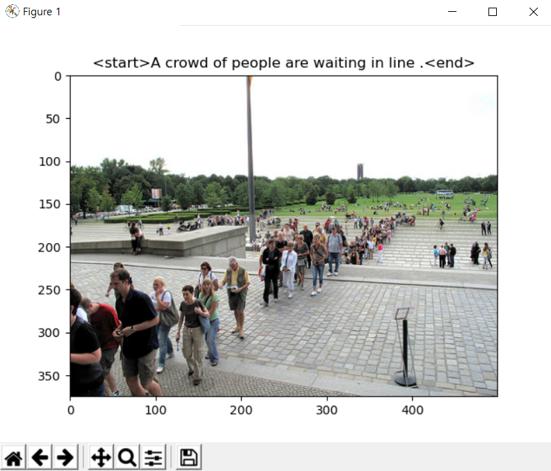

### 4. 이미지와 캡션 시각화

이미지 파일과 캡션을 입력으로 받아 이를 시각화하는 함수를 구현합니다.

이제 와서 보니 또 .. 코드 수정을 좀 하게 되었다..


`train.py`

앞서 구현했던 함수들을 사용하기 위해 import

```python
from config import config
from data import preprocess
from utils import utils

# config 저장
utils.save_config()

# 이미지 경로 및 캡션 불러오기
image_info = preprocess.get_path_caption()

# 전체 데이터셋을 분리해 저장하기
preprocess.dataset_split_save(image_info)

# 저장된 데이터셋 불러오기
print('train 또는 test 를 입력해주세요')
dataset_dict = preprocess.get_data_file(input())

# 데이터 샘플링
# if config.do_sampling:
dataset_sampling = preprocess.sampling_data(input())

# 이미지와 캡션 시각화 하기
utils.visualize_img_caption(dataset_sampling)
```

```python
def visualize_img_caption(dataset):
	img, com = '', ''
	for data in dataset:
		for s in range(len(data)):
			if data[s] == '|':
				img = data[:s]
				com = data[s+1:]
		addr = imread(f'./datasets/images/{img}')

		plt.imshow(addr)
		plt.title(f'<start>{com}<end>')
		plt.show()
```

샘플링 된 string 데이터에서 '|' 로 구분되어 있는 이미지와 캡션을 분리하여 하나씩 받아온다.

plt.imshow()를 사용하여 이미지를 출력할 수 있다. (pip install pillow)



