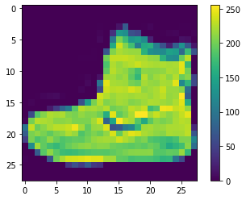
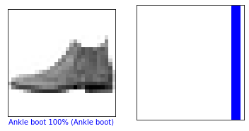
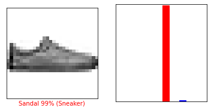
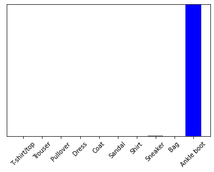

### 5. Fashion MNIST 분류 모델 구현

5-1 Fashion MNIST 데이터 다운 및 시각화

```python
from __future__ import absolute_import, division, print_function, unicode_literals, unicode_literals

import tensorflow as tf
from tensorflow import keras

import numpy as np
import matplotlib.pyplot as plt

print(tf.__version__)
```

    2.0.0

```python
# 패션 MNIST 데이터셋 임포트
fashion_mnist = keras.datasets.fashion_mnist
# load_data() 함수를 호출하면 아래 4개의 넘파이 배열이 반환됨
(train_images, train_labels), (test_images, test_labels) = fashion_mnist.load_data()
```


```python
# 데이터셋에 클래스 이름이 들어있지 않기 때문에 별도의 변수를 만들어 지정
class_names = ['T-shirt/top', 'Trouser', 'Pullover', 'Dress', 'Coat', 
              'Sandal', 'Shirt', 'Sneaker', 'Bag', 'Ankle boot']
```


```python
test_images.shape
```


    (10000, 28, 28)


```python
plt.figure()
plt.imshow(train_images[0])
plt.colorbar()
plt.grid(False)
plt.show()
```




```python
# 픽셀 값의 범위가 0-255임. 이 값의 범위를 0-1 사이로 조정하겠음.
train_images = train_images / 255.0
test_images = test_images / 255.0
```


```python
# 훈련 데이터 포맷이 올바른지 확인하고 네트워크 구성과 훈련할 준비
plt.figure(figsize=(10, 10))
for i in range(25):
    plt.subplot(5, 5, i+1)
    plt.xticks([])
    plt.yticks([])
    plt.grid(False)
    plt.imshow(train_images[i], cmap=plt.cm.binary)
    plt.xlabel(class_names[train_labels[i]])
plt.show()
```


5-2 인공신경망 구현 및 컴파일

  모델 구성, 층 설정
- 신경망의 구성 요소는 층(layer)이다. 층은 주입된 데이터에서 표현을 추출한다. 문제를 해결하는 데 더 의미있는 표현이 추출될 것이다.
- 대부분의 딥러닝은 간단한 층을 연결하여 구성된다.
- tf.keras.layers.Dense 와 같은 층들의 가중치는 훈련하는 동안 학습된다.


```python
model = keras.Sequential([
    keras.layers.Flatten(input_shape=(28, 28)),
    keras.layers.Dense(128, activation='relu'),
    keras.layers.Dense(10, activation='softmax')
])
```

이 네트워크의 첫 번째 층인 tf.keras.layers.Flatten 은 2차원 배열(28\*28)의 이미지 포맷을 28*28=784 의 1차원 배열로 변환한다. 이 층은 이미지에 있는 픽셀의 행을 펼쳐서 일렬로 늘린다. 이 층에는 학습되는 가중치가 없고 데이터 변환만 한다.
픽셀을 펼친 후에 두 개의 tf.keras.layers.Dense 층이 연속되어 연결된다. 이 층을 밀집 연결(densely-connected) 또는 완전 연결(fully-connected) 층이라고 부른다.
첫 번째 Dense 층은 128개의 노드(또는 뉴런)를 가진다. 두 번째(마지막) 층은 10개의 노드의 소프트맥스층이다. 이 층은 10개의 확률을 반환하고 반환된 값의 전체 합은 1이다. 각 노드는 현재 이미지가 10개 클래스 중 하나에 속할 확률을 출력한다.


```python
# 모델 컴파일 : 모델을 훈련하기 전에 필요한 설정
model.compile(optimizer='adam',
             loss='sparse_categorical_crossentropy',
             metrics=['accuracy'])
```


5-3 모델 학습 및 테스트

  모델 훈련

1. 훈련 데이터를 모델에 주입한다. train_images, train_labels
2. 모델이 이미지와 레이블을 매핑하는 방법을 배운다.
3. 테스트 세트에 대한 모델의 예측을 만든다. test_images 배열. 이 예측이 test_labels 배열의 레이블과 맞는지 확인한다.


```python
model.fit(train_images, train_labels, epochs=10)
```

    Train on 60000 samples
    Epoch 1/10
    60000/60000 [==============================] - 3s 54us/sample - loss: 0.1962 - accuracy: 0.9262
    Epoch 2/10
    60000/60000 [==============================] - 3s 55us/sample - loss: 0.1922 - accuracy: 0.9276
    Epoch 3/10
    60000/60000 [==============================] - 3s 57us/sample - loss: 0.1892 - accuracy: 0.9286
    Epoch 4/10
    60000/60000 [==============================] - 3s 54us/sample - loss: 0.1841 - accuracy: 0.9297
    Epoch 5/10
    60000/60000 [==============================] - 3s 55us/sample - loss: 0.1792 - accuracy: 0.9322
    Epoch 6/10
    60000/60000 [==============================] - 3s 54us/sample - loss: 0.1747 - accuracy: 0.9337
    Epoch 7/10
    60000/60000 [==============================] - 3s 54us/sample - loss: 0.1712 - accuracy: 0.9352
    Epoch 8/10
    60000/60000 [==============================] - 3s 54us/sample - loss: 0.1678 - accuracy: 0.9364
    Epoch 9/10
    60000/60000 [==============================] - 3s 54us/sample - loss: 0.1639 - accuracy: 0.9373
    Epoch 10/10
    60000/60000 [==============================] - 5s 78us/sample - loss: 0.1586 - accuracy: 0.9414
    
    <tensorflow.python.keras.callbacks.History at 0x21b26ef3788>

- epochs 5일 때 훈련 세트에서 약 0.88 정도의 정확도 달성
- epochs 10일 때 훈련 세트에서 약 0.92 정도의 정확도 달성


```python
# 정확도 평가 : 그 다음 테스트 세트에서 모델의 성능을 비교한다.
test_loss, test_acc = model.evaluate(test_images, test_labels, verbose=2)
print('테스트 정확도: ', test_acc)
```

    10000/1 - 0s - loss: 0.2639 - accuracy: 0.8884
    테스트 정확도:  0.8884


- 테스트 세트의 정확도가 훈련 세트의 정확도보다 조금 낮다. 훈련 세트의 정확도와 테스트 세트의 정확도 사이의 차이는 overfitting 때문이다.


5-4 테스트 결과 시각화


```python
# 예측 만들기 : 훈련된 모델을 사용하여 이미지에 대한 예측 만들기
predictions = model.predict(test_images)
```


```python
# 테스트 세트에 있는 각 이미지의 레이블을 예측한다. 첫 번째 예측 확인
predictions[0]
```


    array([1.7601879e-13, 8.5432294e-15, 4.7925706e-16, 4.7869198e-18,
           6.7109355e-13, 2.1202037e-05, 1.6984966e-13, 3.3402473e-03,
           2.9903163e-13, 9.9663854e-01], dtype=float32)

- 10개의 옷 품목에 상응하는 모델의 신뢰도를 나타낸다.


```python
# 가장 높은 신뢰도를 가진 레이블 찾기
np.argmax(predictions[0])
```


    9

- 앵클 부츠(class_name[9])라고 가장 확신하고 있다.


```python
# 값이 맞는지 테스트 레이블 확인
test_labels[0]
```


    9


```python
# 10개 클래스에 대한 예측을 그래프로 표현하기
def plot_image(i, predictions_array, true_label, img):
    predictions_array, true_label, img = predictions_array[i], true_label[i], img[i]
    plt.grid(False)
    plt.xticks([])
    plt.yticks([])

    plt.imshow(img, cmap=plt.cm.binary)

    predicted_label = np.argmax(predictions_array)
    if predicted_label == true_label:
        color = 'blue'
    else:
        color = 'red'

    plt.xlabel("{} {:2.0f}% ({})".format(class_names[predicted_label],
                                100*np.max(predictions_array),
                                class_names[true_label]),
                                color=color)

def plot_value_array(i, predictions_array, true_label):
    predictions_array, true_label = predictions_array[i], true_label[i]
    plt.grid(False)
    plt.xticks([])
    plt.yticks([])
    thisplot = plt.bar(range(10), predictions_array, color="#777777")
    plt.ylim([0, 1])
    predicted_label = np.argmax(predictions_array)

    thisplot[predicted_label].set_color('red')
    thisplot[true_label].set_color('blue')
```


```python
i = 0
plt.figure(figsize=(6,3))
plt.subplot(1,2,1)
plot_image(i, predictions, test_labels, test_images)
plt.subplot(1,2,2)
plot_value_array(i, predictions,  test_labels)
plt.show()
```




```python
i = 12
plt.figure(figsize=(6,3))
plt.subplot(1,2,1)
plot_image(i, predictions, test_labels, test_images)
plt.subplot(1,2,2)
plot_value_array(i, predictions,  test_labels)
plt.show()
```




- 잘못 예측하고 있다. 그런데 학습을 더 시켜도 결과가 동일하다...

```python
# 처음 X 개의 테스트 이미지와 예측 레이블, 진짜 레이블을 출력합니다
# 올바른 예측은 파랑색으로 잘못된 예측은 빨강색으로 나타냅니다
num_rows = 5
num_cols = 3
num_images = num_rows*num_cols
plt.figure(figsize=(2*2*num_cols, 2*num_rows))
for i in range(num_images):
  plt.subplot(num_rows, 2*num_cols, 2*i+1)
  plot_image(i, predictions, test_labels, test_images)
  plt.subplot(num_rows, 2*num_cols, 2*i+2)
  plot_value_array(i, predictions, test_labels)
plt.show()
```


```python
# 테스트 세트에서 이미지 하나를 선택한다
img = test_images[0]
print(img.shape)
```

    (28, 28)

```python
# tf.keras 모델은 한 번에 샘플의 묶음 또는 배치로 예측을 만드는데 최적화되어있음
# 하나의 이미지를 사용할 때에도 2차원 배열로 만들어야 한다.
img = (np.expand_dims(img, axis=0))
print(img.shape)
```

    (1, 28, 28)

```python
# 이미지의 예측을 만든다
predictions_single = model.predict(img)
print(predictions_single)
```

    [[1.7601845e-13 8.5431963e-15 4.7925706e-16 4.7869016e-18 6.7109355e-13
      2.1202099e-05 1.6984999e-13 3.3402473e-03 2.9903163e-13 9.9663854e-01]]

```python
plot_value_array(0, predictions_single, test_labels)
_ = plt.xticks(range(10), class_names, rotation=45)
```




```python
np.argmax(predictions_single[0])
```


    9
